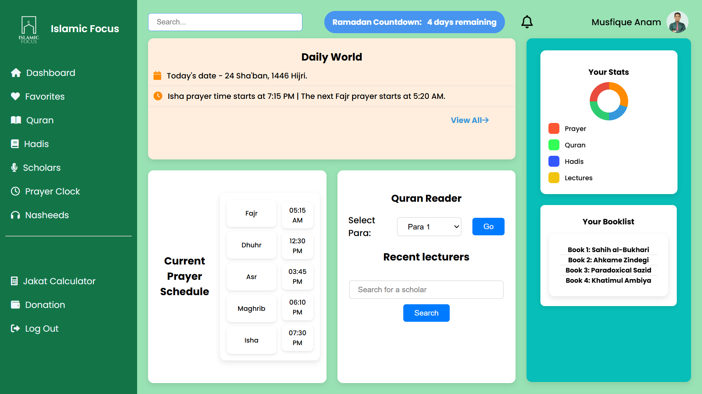

# Islamic Focus Dashboard

Islamic Focus Dashboard is a clean, responsive, and modern HTML-CSS dashboard UI inspired by Islamic culture. It serves as a foundational layout for Islamic apps featuring prayer times, Quran reading, lectures, donations, and more.

## Preview



## Features

- 🌙 **Islamic-themed sidebar navigation** with icons for easy access to Quran, Hadis, prayer clock, and other sections.
- 📅 **Prayer times and Ramadan countdown** display.
- 📚 **Booklist** showcasing important Islamic books.
- 🔔 **Notification bar** with upcoming event reminders.
- 🔍 **Searchable scholars and lectures** area.
- 🎨 Responsive layout built with HTML and CSS, leveraging Flexbox and Grid.
- 📦 Uses FontAwesome icons for enhanced UI.

## How to Use

1. Clone the repository:
   ```bash
   git clone https://github.com/musfique-anam/islamic-focus.git
